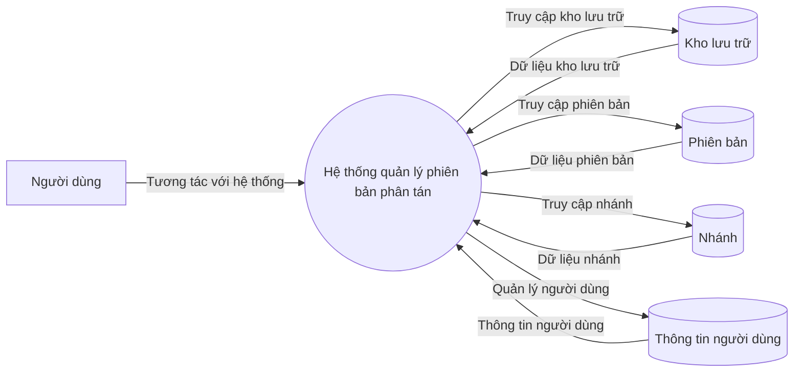
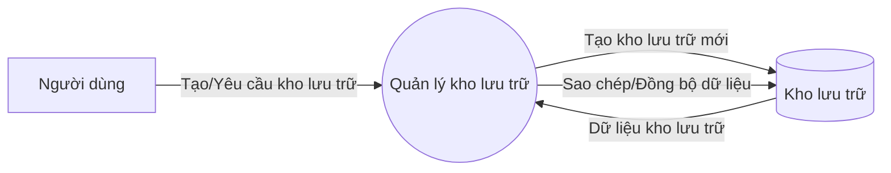
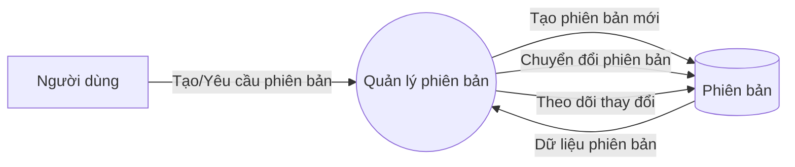
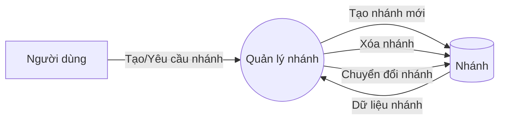
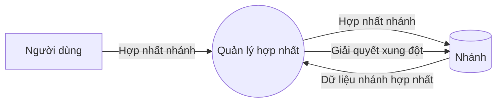
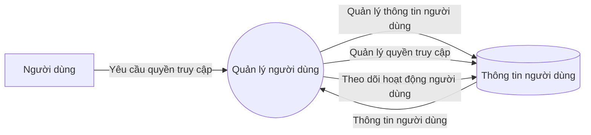
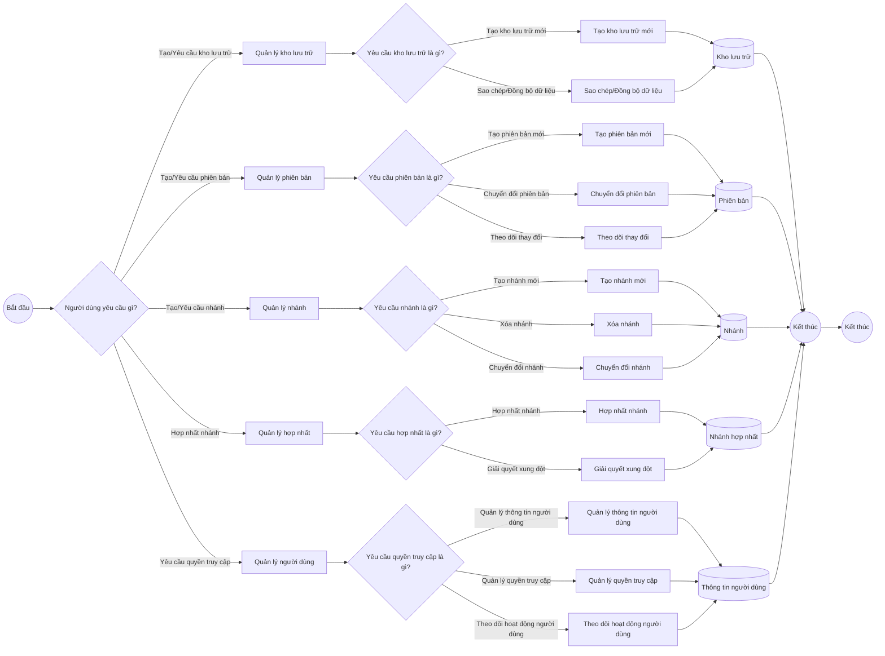

#  Các biểu đồ của DVCS (Phần 2)
## Biểu đồ phân cấp chức năng
```
graph LR
    A[Hệ thống quản lý phiên bản phân tán] --> B1[Quản lý kho lưu trữ]
    A --> B2[Quản lý phiên bản]
    A --> B3[Quản lý nhánh]
    A --> B4[Quản lý hợp nhất]
    A --> B5[Quản lý người dùng]

    B1 --> C1[Khởi tạo kho lưu trữ]
    B1 --> C2[Sao chép kho lưu trữ]
    B1 --> C3[Đồng bộ kho lưu trữ]

    B2 --> C4[Tạo phiên bản mới]
    B2 --> C5[Chuyển đổi phiên bản]
    B2 --> C6[Theo dõi thay đổi]

    B3 --> C7[Tạo nhánh mới]
    B3 --> C8[Chuyển đổi nhánh]
    B3 --> C9[Xóa nhánh]

    B4 --> C10[Hợp nhất nhánh]
    B4 --> C11[Giải quyết xung đột]

    B5 --> C12[Quản lý quyền truy cập]
    B5 --> C13[Quản lý thông tin người dùng]
    B5 --> C14[Theo dõi hoạt động người dùng]
```

## Biểu đồ luồng dữ liệu (mức ngữ cảnh)
```
flowchart LR
    %% Đầu cuối
    A1[Người dùng] -->|Tương tác với hệ thống| P1((Hệ thống quản lý phiên bản phân tán))

    %% Xử lý
    P1 -->|Truy cập kho lưu trữ| D1[(Kho lưu trữ)]
    P1 -->|Truy cập phiên bản| D2[(Phiên bản)]
    P1 -->|Truy cập nhánh| D3[(Nhánh)]
    P1 -->|Quản lý người dùng| D4[(Thông tin người dùng)]

    %% Luồng dữ liệu
    D1 -->|Dữ liệu kho lưu trữ| P1
    D2 -->|Dữ liệu phiên bản| P1
    D3 -->|Dữ liệu nhánh| P1
    D4 -->|Thông tin người dùng| P1
```

## Biểu đồ luồng dữ liệu (mức đỉnh)
```
flowchart LR
    %% Đầu cuối
    A1[Người dùng] -->|Tạo/Yêu cầu kho lưu trữ| P1((Quản lý kho lưu trữ))
    A1 -->|Tạo/Yêu cầu phiên bản| P2((Quản lý phiên bản))
    A1 -->|Tạo/Yêu cầu nhánh| P3((Quản lý nhánh))
    A1 -->|Hợp nhất nhánh| P4((Quản lý hợp nhất))
    A1 -->|Yêu cầu quyền truy cập| P5((Quản lý người dùng))

    %% Xử lý
    P1 -->|Tạo kho lưu trữ mới| D1[(Kho lưu trữ)]
    P1 -->|Sao chép/Đồng bộ dữ liệu| D1
    P2 -->|Tạo phiên bản mới| D2[(Phiên bản)]
    P2 -->|Chuyển đổi phiên bản| D2
    P2 -->|Theo dõi thay đổi| D2
    P3 -->|Tạo/Xóa/Chuyển đổi nhánh| D3[(Nhánh)]
    P4 -->|Hợp nhất nhánh| D3
    P4 -->|Giải quyết xung đột| D3
    P5 -->|Quản lý thông tin người dùng| D4[(Thông tin người dùng)]
    P5 -->|Quản lý quyền truy cập| D4
    P5 -->|Theo dõi hoạt động người dùng| D4

    %% Luồng dữ liệu
    D1 -->|Dữ liệu kho lưu trữ| P1
    D2 -->|Dữ liệu phiên bản| P2
    D3 -->|Dữ liệu nhánh| P3
    D3 -->|Dữ liệu nhánh hợp nhất| P4
    D4 -->|Thông tin người dùng| P5
```

## Biểu đồ luồng dữ liệu (mức dưới đỉnh)
### Quản lý kho lưu trữ
```
flowchart LR
    %% Đầu cuối
    A1[Người dùng] -->|Tạo/Yêu cầu kho lưu trữ| P1((Quản lý kho lưu trữ))

    %% Xử lý
    P1 -->|Tạo kho lưu trữ mới| D1[(Kho lưu trữ)]
    P1 -->|Sao chép/Đồng bộ dữ liệu| D1

    %% Luồng dữ liệu
    D1 -->|Dữ liệu kho lưu trữ| P1
```

### Quản lý phiên bản
```
flowchart LR
    %% Đầu cuối
    A1[Người dùng] -->|Tạo/Yêu cầu phiên bản| P2((Quản lý phiên bản))

    %% Xử lý
    P2 -->|Tạo phiên bản mới| D2[(Phiên bản)]
    P2 -->|Chuyển đổi phiên bản| D2
    P2 -->|Theo dõi thay đổi| D2

    %% Luồng dữ liệu
    D2 -->|Dữ liệu phiên bản| P2
```

### Quản lý nhánh
```
flowchart LR
    %% Đầu cuối
    A1[Người dùng] -->|Tạo/Yêu cầu nhánh| P3((Quản lý nhánh))

    %% Xử lý
    P3 -->|Tạo nhánh mới| D3[(Nhánh)]
    P3 -->|Xóa nhánh| D3
    P3 -->|Chuyển đổi nhánh| D3

    %% Luồng dữ liệu
    D3 -->|Dữ liệu nhánh| P3
```

### Quản lý hợp nhất
```
flowchart LR
    %% Đầu cuối
    A1[Người dùng] -->|Hợp nhất nhánh| P4((Quản lý hợp nhất))

    %% Xử lý
    P4 -->|Hợp nhất nhánh| D3[(Nhánh)]
    P4 -->|Giải quyết xung đột| D3

    %% Luồng dữ liệu
    D3 -->|Dữ liệu nhánh hợp nhất| P4
```

### Quản lý người dùng
```
flowchart LR
    %% Đầu cuối
    A1[Người dùng] -->|Yêu cầu quyền truy cập| P5((Quản lý người dùng))

    %% Xử lý
    P5 -->|Quản lý thông tin người dùng| D4[(Thông tin người dùng)]
    P5 -->|Quản lý quyền truy cập| D4
    P5 -->|Theo dõi hoạt động người dùng| D4

    %% Luồng dữ liệu
    D4 -->|Thông tin người dùng| P5
```

## Mô hình thực thể kết hợp
```
erDiagram
    %% Các thực thể và thuộc tính
    NGUOIDUNG {
        int nguoidung_id PK
        string tennguoidung
        string email
        string matkhau
        string vaitro
    }

    KHO {
        int kho_id PK
        string ten
        string mota
        int chu_id FK
    }

    PHIENBAN {
        int phienban_id PK
        string ten
        date ngaytao
        int kho_id FK
    }

    NHANH {
        int nhanh_id PK
        string ten
        int kho_id FK
        int phienban_goc_id FK
    }

    HOPNHAT {
        int hopnhat_id PK
        int nhanh_nguon_id FK
        int nhanh_dich_id FK
        date ngayhopnhat
        string trangthai
    }

    QUYEN {
        int quyen_id PK
        int nguoidung_id FK
        int kho_id FK
        string quyenhan
    }

    HOATDONG {
        int hoatdong_id PK
        int nguoidung_id FK
        string hanhdong
        date thoigian
        int kho_id FK
    }

    %% Các mối quan hệ
    NGUOIDUNG ||--o{ KHO : "sở hữu"
    KHO ||--o{ PHIENBAN : "chứa"
    KHO ||--o{ NHANH : "chứa"
    PHIENBAN ||--o{ NHANH : "phiên bản gốc"
    NHANH ||--o{ HOPNHAT : "tham gia"
    HOPNHAT }o--|| NHANH : "nguồn"
    HOPNHAT }o--|| NHANH : "đích"
    NGUOIDUNG ||--o{ QUYEN : "được cấp"
    KHO ||--o{ QUYEN : "quản lý"
    NGUOIDUNG ||--o{ HOATDONG : "thực hiện"
    KHO ||--o{ HOATDONG : "liên quan"
```

## Lưu đồ giải thuật
```
flowchart LR
    %% Đầu cuối
    A0((Bắt đầu))

    %% Quyết định yêu cầu người dùng
    A0 --> B1{Người dùng yêu cầu gì?}
    B1 -->|Tạo/Yêu cầu kho lưu trữ| C1[Quản lý kho lưu trữ]
    B1 -->|Tạo/Yêu cầu phiên bản| C2[Quản lý phiên bản]
    B1 -->|Tạo/Yêu cầu nhánh| C3[Quản lý nhánh]
    B1 -->|Hợp nhất nhánh| C4[Quản lý hợp nhất]
    B1 -->|Yêu cầu quyền truy cập| C5[Quản lý người dùng]

    %% Xử lý Quản lý kho lưu trữ
    C1 --> D1{Yêu cầu kho lưu trữ là gì?}
    D1 -->|Tạo kho lưu trữ mới| E1[Tạo kho lưu trữ mới]
    D1 -->|Sao chép/Đồng bộ dữ liệu| E2[Sao chép/Đồng bộ dữ liệu]
    E1 --> F1[(Kho lưu trữ)]
    E2 --> F1
    F1 --> G1((Kết thúc))

    %% Xử lý Quản lý phiên bản
    C2 --> D2{Yêu cầu phiên bản là gì?}
    D2 -->|Tạo phiên bản mới| E3[Tạo phiên bản mới]
    D2 -->|Chuyển đổi phiên bản| E4[Chuyển đổi phiên bản]
    D2 -->|Theo dõi thay đổi| E5[Theo dõi thay đổi]
    E3 --> F2[(Phiên bản)]
    E4 --> F2
    E5 --> F2
    F2 --> G1

    %% Xử lý Quản lý nhánh
    C3 --> D3{Yêu cầu nhánh là gì?}
    D3 -->|Tạo nhánh mới| E6[Tạo nhánh mới]
    D3 -->|Xóa nhánh| E7[Xóa nhánh]
    D3 -->|Chuyển đổi nhánh| E8[Chuyển đổi nhánh]
    E6 --> F3[(Nhánh)]
    E7 --> F3
    E8 --> F3
    F3 --> G1

    %% Xử lý Quản lý hợp nhất
    C4 --> D4{Yêu cầu hợp nhất là gì?}
    D4 -->|Hợp nhất nhánh| E9[Hợp nhất nhánh]
    D4 -->|Giải quyết xung đột| E10[Giải quyết xung đột]
    E9 --> F4[(Nhánh hợp nhất)]
    E10 --> F4
    F4 --> G1

    %% Xử lý Quản lý người dùng
    C5 --> D5{Yêu cầu quyền truy cập là gì?}
    D5 -->|Quản lý thông tin người dùng| E11[Quản lý thông tin người dùng]
    D5 -->|Quản lý quyền truy cập| E12[Quản lý quyền truy cập]
    D5 -->|Theo dõi hoạt động người dùng| E13[Theo dõi hoạt động người dùng]
    E11 --> F5[(Thông tin người dùng)]
    E12 --> F5
    E13 --> F5
    F5 --> G1

    %% Kết thúc
    G1 --> H0((Kết thúc))
```

